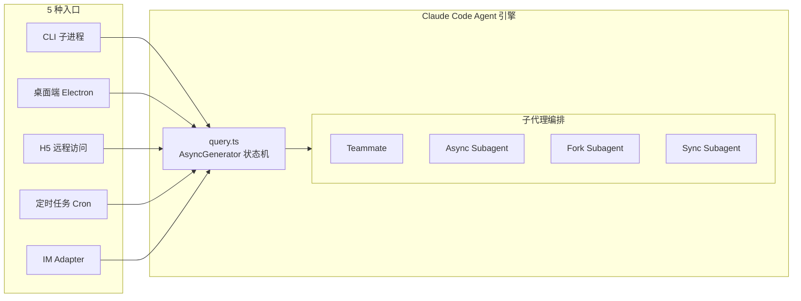
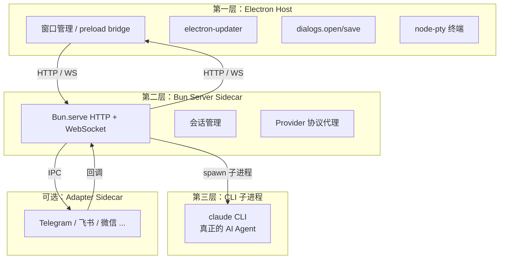
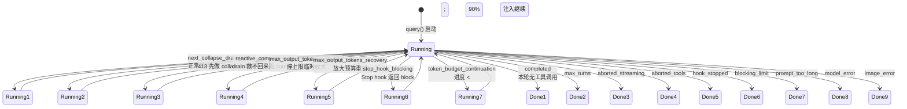
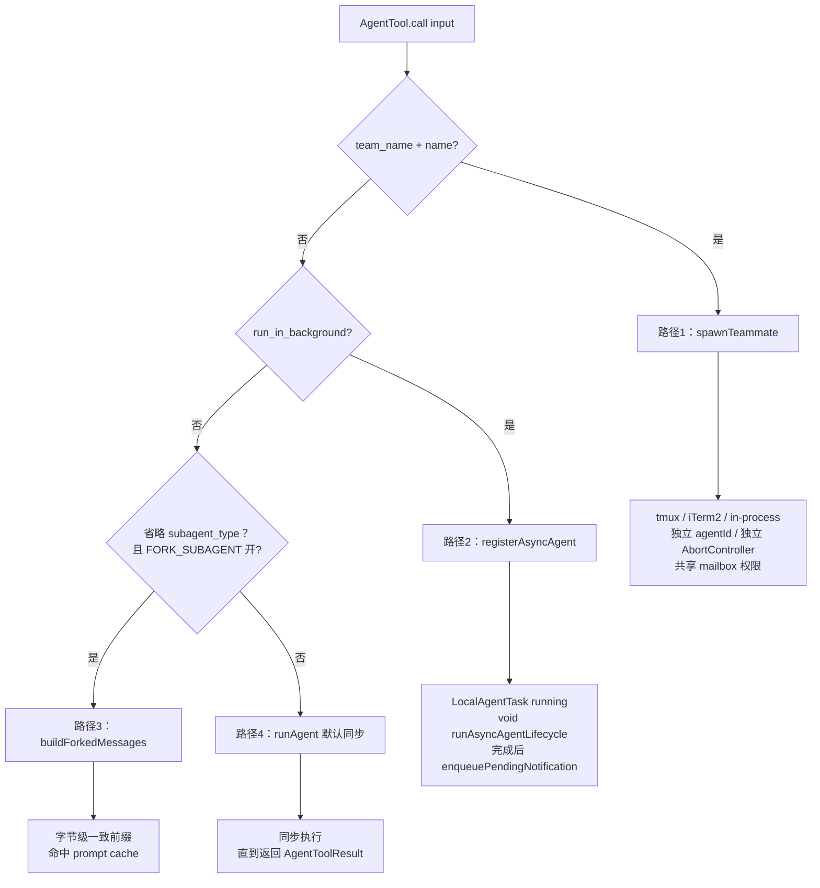
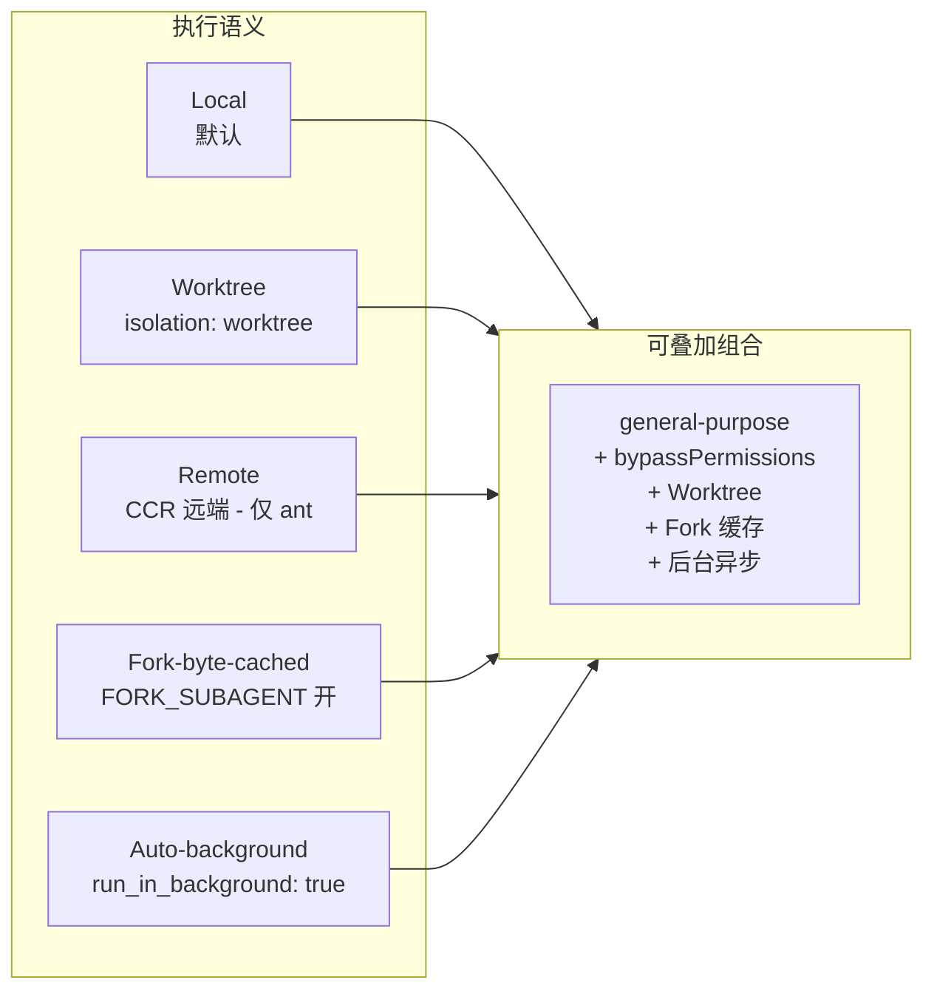

# 从 cc-haha 看 Claude Code：一次 AI 编程助手的"内核级"借鉴

> 一篇给开发者、PM 和 AI 爱好者看的科普长文。聊聊 GitHub 上一个叫 **cc-haha** 的开源项目，如何把泄露出来的 Claude Code 源码，搭成一套真正能用的桌面工作台，并把它背后的工程设计哲学摆在所有人面前。

---

## 目录

1. [开场：cc-haha 是什么](#一开场cc-haha-是什么)
2. [入口端：五条路都能"踢一脚"Claude Code](#二入口端五条路都能踢一脚-claude-code)
3. [桌面端不是"前端塞进 Electron"，而是三层架构](#三桌面端不是前端塞进-electron而是三层架构)
4. [Agent 循环：为什么不是 ReAct？](#四agent-循环为什么不是-react)
5. [钻进 AsyncGenerator 看一眼 —— State / needsFollowUp / transition](#五钻进-asyncgenerator-看一眼--state--needsfollowup--transition)
6. [四条 spawn 路径：同一个 Agent Tool，四个不同脾气](#六四条-spawn-路径同一个-agent-tool-四个不同脾气)
7. [Fork-byte-cached：100k token 的 prompt，凭什么秒回？](#七fork-byte-cached100k-token-的-prompt凭什么秒回)
8. [执行语义 × 隔离 × 权限：把"启动一个 agent"拆开看](#八执行语义--隔离--权限把启动一个-agent-拆开看)
9. [小结：Claude Code 教了我们什么](#九小结claude-code-教了我们什么)

---

## 一、开场：cc-haha 是什么

**cc-haha**（Claude Code Haha）做的事情一句话讲完：

> 把 2026 年 3 月那次泄露出来的 Claude Code 源码，修补、可视化、产品化，做成一个跨平台桌面 App，让你能在 Mac、Windows、Linux 上像用 IDE 一样用 Claude Code，同时还能从手机、从 IM、从定时任务远程指挥它干活。

听起来挺唬人。但这个项目的真正价值不在"能用"，而在——**它把 Claude Code 的整套内部设计哲学，原原本本地摆到了你眼前**。源码是开源的，文档也是开源的（见 `docs/agent/`、`docs/channel/`、`docs/desktop/`）。本文顺着这些代码和文档，聊聊 Claude Code 背后那些不太被人讲清楚的工程思路。

---

## 二、入口端：五条路都能"踢一脚" Claude Code

很多人以为 Claude Code 只是一个命令行工具。在 cc-haha 里，它有 **5 种入口**：

| 入口 | 实现位置 | 说明 |
|------|---------|------|
| **CLI 子进程** | `bin/` | 最经典的玩法，终端里直接 `claude` |
| **桌面端** | `desktop/` | Electron 桌面工作台，三栏布局、Diff 视图、权限卡片 |
| **H5 远程访问** | 桌面端启动后开放 HTTP/WS | 局域网 / HTTPS 反代都能用同一份聊天 UI |
| **定时任务** | `desktop/src/api/tasks.ts`、Cron 解析器 | 用 Cron 表达式设个"每天 9 点扫 issues"之类的活 |
| **IM 适配器** | `adapters/` | Telegram / WeChat / DingTalk / WhatsApp / Feishu 五个独立进程 |

最后这条尤其值得展开。Claude Code 自己设计了一套叫 **Channel** 的 IM 接入系统，本质上就是一个"会声明 `claude/channel` 能力的 MCP Server"。cc-haha 把它落到了 `adapters/` 目录，每个 IM 平台一个独立进程。这样做的好处：

- **崩溃隔离**：微信 SDK 崩了不会拖垮 Claude Code 主进程
- **独立重启**：换 IM 配置不用重启整个桌面
- **平台解耦**：以后想加 Discord / Slack，照模板抄一份 Adapter 就行



> **一句话总结入口端的设计思路**：让 Claude Code 成为一个"被打哪都响"的后台引擎。前端是壳，IM 是壳，CLI 也是壳——核心永远只有一个：那个异步的、可中断的、可恢复的 Agent 循环。

---

## 三、桌面端不是"前端塞进 Electron"，而是三层架构

`docs/desktop/02-architecture.md` 把架构讲得很清楚——它是**三层**：



| 层 | 文件 | 职责 |
|---|------|------|
| **Electron Host** | `desktop/electron/` | 窗口、原生 API、系统能力（文件对话框、终端 PTY、自动更新）。通过 preload 暴露 typed `window.desktopHost`，**React 不直接碰 Electron IPC** |
| **Bun Server Sidecar** | `src/server/` | 动态端口起的 HTTP/WS 服务器，负责会话管理、消息分发、Provider 协议代理 |
| **CLI 子进程** | `bin/claude` | 由 Sidecar spawn 出来的真正 Claude Code 实例，所有 AI 对话、工具调用都在这里面发生 |

每一层职责独立、各自可以独立重启。React 只是 renderer 那一层，通过 typed host contract 调用 host 的能力——这套写法让前端代码可以原封不动跑在浏览器里做测试。

> bun 在这里**主要是 Sidecar 的运行时和构建工具**（`Bun.serve`），不是把前端 bundle 进 Electron 的角色。Electron 那边的打包还是 `electron-builder`。

至于 Tauri——`desktop/src-tauri/` 目录是历史资源位置，已经不作为桌面 runtime 了（迁移调研见 `docs/desktop/07-electron-migration-research.md`）。

---

## 四、Agent 循环：为什么不是 ReAct？

这是整篇文章最硬核的部分。

大多数人理解 Agent 框架，第一反应是 **ReAct**：思考 → 行动 → 观察 → 再思考 → 再行动。LangChain 早期的 Agent 就是这个套路。

Claude Code **不**这么干。它的核心是一个**异步生成器驱动的状态机**，定义在 `src/query.ts` 的 `query()` 函数：

```typescript
// src/query.ts:222
export async function* query(params: QueryParams): AsyncGenerator<...>
```

关键词三个：

1. **`async function*`**：异步生成器，能 `yield` 出消息
2. **状态机**：循环内部维护一个 `State` 对象
3. **`while (true)`**：单层大循环，通过 `state = next` 切换到下一轮

整个 `while(true)` 循环分成**五个阶段**：

| 阶段 | 行号 | 做什么 |
|------|------|--------|
| ① 消息准备与压缩 | query.ts:404-546 | 四层压缩：Snip / Micro / 折叠 / Auto Compact |
| ② 流式 API 调用 | query.ts:661-974 | 流式传输，工具在生成过程中就开始执行 |
| ③ 决策点 | query.ts:1070-1366 | 有工具调用 → 继续；否则走 Stop hook + 收尾 |
| ④ 工具编排执行 | query.ts:1374-1417 | 只读工具并行（最多 10 并发），写工具串行 |
| ⑤ 状态更新与循环 | query.ts:1713-1735 | `state = next; continue` |

这套设计带来的好处：

- **流式**：模型还在生成 `tool_use` 块时，工具就开始跑了（`StreamingToolExecutor`）
- **可恢复**：任何阶段出错，修改 `state` 就能从那一轮重起
- **无栈溢出**：没有递归调用，深度对话也不会爆栈
- **可压缩**：进入 API 调用前，对话历史会过四层压缩，长对话不退化

再读一遍这五阶段，你会发现**真正的工作量只有模型调用和工具执行**，其它三步都是"调度"。这就是 Claude Code 为什么能又快又稳。

---

## 五、钻进 AsyncGenerator 看一眼 —— State / needsFollowUp / transition

上一节我们说"核心循环是一个 AsyncGenerator 状态机"。这一节不展开讨论**它做什么**，而是**它怎么决定下一步**。三件事：State 对象、needsFollowUp 判定、transition.reason。

### 5.1 State：状态机有 10 个字段的"完整记忆"

`src/query.ts` 里 `State` 类型是这个状态机的全部"短期记忆"。每轮结束 `state = next` 时，下面这些字段会被整体替换：

| # | 字段 | 作用 | 何时被改 |
|---|---|---|---|
| ① | `messages` | 完整对话历史（用户/助手/工具结果/压缩摘要） | 每轮重写为 `[...messagesForQuery, ...assistantMessages, ...toolResults]`（query.ts:1724） |
| ② | `toolUseContext` | 工具执行上下文：abortController、permission 回调、queryTracking、options.tools 等 | 工具执行阶段更新 queryTracking |
| ③ | `autoCompactTracking` | 自动压缩的子状态机（已压缩多少、当前阶段、剩余预算） | 压缩阶段读写，snip/micro/collapse/auto compact 共享 |
| ④ | `maxOutputTokensRecoveryCount` | "模型输出撞到上限"的重试计数 | 撞上限时 +1，到阈值就 escalate |
| ⑤ | `hasAttemptedReactiveCompact` | 这一轮是否已经走过 reactive compact——**防死循环的关键旗** | 走 reactive compact 后置 true，下一轮再 413 直接报错 |
| ⑥ | `maxOutputTokensOverride` | 临时放大输出 token 预算的 override | 撞上限 → 提升 → 写回 state → 下轮用更大预算 |
| ⑦ | `pendingToolUseSummary` | 跨轮的 Haiku 摘要 Promise | 等模型流时并行起 Haiku，下一轮开头 `await` 拿结果 |
| ⑧ | `stopHookActive` | Stop hook 触发的"非用户中断"标记 | 决定要不要走 stop_hook 回路，区别于 `aborted` |
| ⑨ | `turnCount` | 已完成的对话轮数 | 每轮 +1；超 `maxTurns` 走终止路径 |
| ⑩ | `transition` | "为什么跳到这一轮"——Continue 类型 | 每次 `state = next` 写新 reason |

关键设计：**没有递归、没有全局变量**。所有跨轮信息都在 `state` 里，下一轮决策也来自这个对象。**单元测试可以直接断言 `state.transition.reason` 是不是 `'reactive_compact_retry'`**，验证状态机有没有走错路径。

### 5.2 工具 vs 答案：判定权在宿主代码，不在模型

很多人误以为"模型自己说自己是不是工具调用"。**不是**。

每一轮结束，宿主代码用 `needsFollowUp` 这个布尔来判定"模型本轮输出是工具，还是最终答案"：

```typescript
// 循环开头
let needsFollowUp = false                            // 默认 = "本轮是答案"

// 流式解析阶段（query.ts:839-842）
if (msgToolUseBlocks.length > 0) {                   // 模型输出了 tool_use 块
  toolUseBlocks.push(...msgToolUseBlocks)
  needsFollowUp = true                               // 标记为"工具调用"
}

// 决策点（query.ts:1070, 1365）
if (!needsFollowUp) {
  // 跑 stop hook / 检查 token 预算 ...
  return { reason: 'completed' }                     // 退出 generator
}
// 否则进入阶段 4 执行工具 → 阶段 5 state = next; continue
```

判定逻辑很朴素：**模型流式响应里只要出现 `tool_use` 块，本轮就是"工具"；否则就是"答案"**。

### 5.3 transition 的 7 种 Continue + 10+ 种 Terminal

但状态机远比"工具/答案"二态复杂。`state.transition.reason` 详细记录了"这一轮为什么进入下一轮"。从 `src/query.ts` grep 出 **7 种正常 Continue reason** 和 **10+ 种终止 reason**：



**7 种 Continue（`state = next; continue`）**

| reason | 触发场景 |
|---|---|
| `next_turn` | 正常路径——本轮有工具调用 |
| `collapse_drain_retry` | 遇到 413，先做一轮 context collapse drain 再试 |
| `reactive_compact_retry` | drain 救不回来，跑 reactive compact 后重试 |
| `max_output_tokens_escalate` | 模型输出撞上限，临时放大预算再发 |
| `max_output_tokens_recovery` | 放大预算后的重试计数 |
| `stop_hook_blocking` | Stop hook 返回 block，阻止结束，再来一轮 |
| `token_budget_continuation` | 用户设了 token 预算，进度 < 90% 时注入"继续"提示 |

**10+ 种 Terminal（`return { reason }` 终结 generator）**

`completed` / `max_turns` / `aborted_streaming` / `aborted_tools` / `hook_stopped` / `stop_hook_prevented` / `blocking_limit` / `image_error` / `model_error` / `prompt_too_long` 等。

> 只有最后那个 `return` 才是 async generator 协议意义上的"结束"。`return` 的值对应类型签名 `AsyncGenerator<..., Terminal>` 的第二个参数——外部 caller 通过它判断"对话是怎么收尾的"。

### 5.4 yield 给 UI 的不只是"工具/答案"

很多读者以为这个 generator 一轮只 yield 一个东西。其实 `AsyncGenerator<StreamEvent | RequestStartEvent | Message | TombstoneMessage | ToolUseSummaryMessage, Terminal>` 的第一个泛型告诉我们——**一次 query 过程 yield 出去的事件类型多达 5 种**：

| 阶段 | yield 出的事件类型 | UI 用途 |
|---|---|---|
| 阶段 0 | `stream_request_start` | 显示 "thinking…" |
| 阶段 1 | `snip_boundary` / `collapse_boundary` / 自动压缩摘要 | 显示压缩提示 |
| 阶段 2 | assistant message 流式 delta | 实时打字效果 |
| 阶段 2 异常 | `withheldByCollapse` / `withheldByReactive` 等 attachment | 不 yield 给用户，留在 stream 里下轮用 |
| 阶段 3 | `max_turns_reached` 等 attachment | 显示"已达上限" |
| 阶段 4 | `tool_result` 消息（一个工具一个） | 显示工具调用结果 |
| 阶段 4 | `hook_stopped_continuation` attachment | 标记"被 hook 拦了" |
| 阶段 4 末尾 | `ToolUseSummaryMessage`（Haiku 摘要） | 显示"本轮工具小结" |

**整个 UI 上的"压缩提示、打字效果、工具结果、小结、横幅警告"全部由 generator yield 出来的事件驱动**。这也是为什么 cc-haha 的桌面端能做出那么顺滑的流式渲染——前端不写任何轮询逻辑，只订阅这个 generator 就行。

### 5.5 跑一遍多轮：你看到的"对话"

把上面的判定规则连起来跑一遍：

**正常路径**：
```
第 1 轮: user 提问
       ↓
       模型流式输出: text("我来看看") + tool_use(Read)
       needsFollowUp = true
       跑工具 → state = next (reason: 'next_turn'); continue

第 2 轮: state.messages = [user, assistant+tool_use, tool_result]
       ↓
       模型流式输出: text("我修好了")  ← 只有 text
       needsFollowUp = false
       return { reason: 'completed' }  ← 退出，UI 看到最终文本
```

**连续工具调用**（修一个大文件常见）：
```
第 1 轮: tool_use(Bash)  → 工具
第 2 轮: tool_use(Edit)  → 工具
第 3 轮: tool_use(Edit)  → 工具
第 4 轮: tool_use(Bash)  → 工具
第 5 轮: text("完成")    → 答案 → return
```

**中间出错**（reactive compact 介入）：
```
第 1 轮: tool_use(Bash)            → 工具
第 2 轮: 413 prompt_too_long       → reactive compact
                                  → state.transition = 'reactive_compact_retry'; continue
第 3 轮: tool_use(Edit)            → 工具
第 4 轮: text("完成")              → 答案
```

用户全程不感知——reactive compact 是自动的，只在 token 预算真撑不住时才启动，状态机内部已经把它消化掉。

### 5.6 小结

把第四节讲的"五阶段循环"打开看，里面有三层关键设计：

1. **State 是唯一记忆源**：10 个字段覆盖了"压缩、恢复、预算、轮次、转换原因"——所有跨轮信息都在这里，没有散落的全局变量
2. **判定权在宿主**：模型只管生成 `tool_use`，是不是"工具轮"由宿主代码用 `needsFollowUp` 判定——这避免了让模型自报家门
3. **状态机的可观测性**：`state.transition.reason` 把每一次"为什么要跳到下一轮"都显式写出来——7 种 Continue + 10+ 种 Terminal 让测试可以直接断言恢复路径

这就是为什么 Claude Code 在长对话里几乎不出错。ReAct 那种"思考 → 行动 → 观察"的递归调用，在深层栈里很容易丢上下文、漏边界情况；而 AsyncGenerator + 显式 State 让每一步都可暂停、可观察、可回放。

---

## 六、四条 spawn 路径：同一个 Agent Tool，四个不同脾气

主循环里如果模型决定"我要再开一个 agent"，就走 `AgentTool.call()`。这个函数是所有子代理的统一入口，但根据输入参数不同，会路由到四条完全不同的路径：



### 路径 1：Teammate（队友）

**触发条件**：参数里同时有 `team_name` 和 `name`。

走 `spawnTeammate()`，本质上是在 tmux / iTerm2 / in-process 里新开一个 Claude Code 实例：

- 独立的 `agentId`（`formatAgentId(name, teamName)`）
- 独立颜色（从预定义调色板）
- 独立 AbortController——**不会因为 leader 中断而中断**
- in-process 模式下用 `AsyncLocalStorage` 做上下文隔离
- 共享一个权限管道和邮箱通信

这就是 Claude Code 那套"Agent Teams"的底层——一个 leader，可以并行指挥多个 teammate，每个 teammate 之间通过 mailbox 通信。

### 路径 2：Async Subagent（后台任务）

**触发条件**：`run_in_background=true` 或 Agent 定义里 `background: true`。

`registerAsyncAgent()` 会：

1. 创建一个 `LocalAgentTask`（状态 `running`）
2. 注册到 `agentNameRegistry`（如有 `name`）
3. 创建输出文件符号链接
4. 创建 AbortController（链接到父代理）
5. 发射 SDK event: `task_started`
6. **`void runAsyncAgentLifecycle()`**——注意这个 `void`，主代理不等它执行完，**异步分离**

执行期间持续发 SDK progress events（token、tool count、activity）；完成后通过 `enqueuePendingNotification()` 通知主代理。这条路径是 Claude Code 能"并行干多件事"的关键——你让它一边跑测试、一边改文档，靠的就是这条。

### 路径 3：Fork Subagent（分叉）

**触发条件**：省略 `subagent_type` 且 `FORK_SUBAGENT` 特性开关开启。

核心思想：**不开新会话，复用当前会话的全部前缀，只追加一句"你这个分叉去做这件事"的指令**。

具体做法 `buildForkedMessages()`：

1. 保留父代理完整的 assistant message（所有 `tool_use` 块）
2. 为每个 `tool_use` 构造**字节级一致**的占位 `tool_result`
3. 追加 per-child directive 作为唯一差异部分

这样构造出来的 API 请求，**前缀跟父代理完全一致**——Claude API 的 prompt cache 就能命中。详见下一节。

### 路径 4：Sync Subagent（同步前台）

**默认路径**。`runAgent()` 直接同步执行，子代理跑完才返回。简单场景下最直接。

### 工具池的三层过滤

不论走哪条路径，agent 的工具池都会经过**三层过滤**：

```
所有可用工具
  │
  ├─ 减去 ALL_AGENT_DISALLOWED_TOOLS       ← 通用禁止（TaskOutput、Agent、AskUserQuestion…）
  │
  ├─ 非内置？减去 CUSTOM_AGENT_DISALLOWED_TOOLS
  │
  ├─ 异步？限制为 ASYNC_AGENT_ALLOWED_TOOLS ← 15 个白名单
  │
  ├─ 有 tools 列表？取交集
  │
  ├─ 有 disallowedTools？取差集
  │
  └─ 最终工具池
```

---

## 七、Fork-byte-cached：100k token 的 prompt，凭什么秒回？

上一节路径 3 提到 Fork 用 prompt cache 复用前缀，这点单独展开讲，因为**它对长 prompt 的体验提升是质变级的**。

### 7.1 Claude API 的 prompt cache 是什么

Claude API 的 prompt cache 是按 token 前缀命中来算的：

- 前 1024 个 token 之内只要有变化，**整个 cache 就废了**
- 前缀完全一致时，命中缓存的价格是普通输入的 **1/10**
- 速度也快数倍（首 token 延迟从几秒压到几百毫秒）

### 7.2 Fork 的精妙之处

Fork 强制让多个子代理的 API 请求前缀**字节级一致**：

```
┌─────────────────────────────────────────────┐
│           共享前缀（字节一致）                  │
│  ┌──────────────────────────────────────┐   │
│  │ System Prompt                         │   │
│  │ User Context                          │   │
│  │ System Context                        │   │
│  │ Tool Use Context                      │   │
│  │ 对话历史 Messages                     │   │
│  │ Assistant Message (all tool_use)      │   │
│  │ User Message (placeholder results)    │   │
│  └──────────────────────────────────────┘   │
├─────────────────────────────────────────────┤
│  唯一差异: per-child directive text         │
└─────────────────────────────────────────────┘
```

父代理的所有历史、所有工具调用的占位结果都是相同的。唯一不同的只有最末尾那句"去干 X"。

### 7.3 收益对比

对一个 100k+ token 的项目上下文：

| 模式 | Token 消耗 | 首 token 延迟 |
|------|-----------|--------------|
| 不 Fork（开新 subagent） | 重传 100k token | 几十秒 |
| Fork（命中缓存） | 只付 1k token 的 directive | 几百毫秒 |

**不仅省 token，还省时间**。长 prompt 的首 token 延迟本来就高，命中缓存能把 TTFT（time-to-first-token）从几秒压到几百毫秒。

### 7.4 行为约束 + 防递归

代码里还有一个叫 `isInForkChild()` 的守卫，防止 fork 里再 fork 形成递归；还有 `FORK_BOILERPLATE_TAG` 注入到子代理的系统提示里，约束它的行为：

```
1. 你是分叉的工作进程，不是主代理
2. 不要对话、提问或建议后续步骤
3. 直接使用工具（Bash、Read、Write 等）
4. 如修改文件，在报告前提交更改
5. 工具调用之间不要输出文本
6. 严格限制在指令范围内
7. 报告控制在 500 词以内
8. 响应必须以 "Scope:" 开头
```

这套机制把"性能优化"和"行为约束"绑在了一起，挺值得借鉴。

---

## 八、执行语义 × 隔离 × 权限：把"启动一个 agent"拆开看

前面讲 4 条 spawn 路径讲的是**调度路由**——同一个入口按参数分流。但代码层面，决定"一个 agent 到底在哪跑、用什么姿势跑、能改哪些东西"，其实是**三套互相正交的维度**。这套说法是把 `src/tools/AgentTool/AgentTool.tsx` 的 schema、`docs/agent/01-usage-guide.md` 的速查表、以及 `src/bootstrap/state.ts` 的运行状态汇总之后得到的，**跟源码能对得上**。

### 8.1 维度一：5 种执行语义



| 模式 | 触发方式 | 行为 |
|------|----------|------|
| **Local（默认）** | 默认 | 继承父代理的工作目录、共享 `toolUseContext`，同步跑完 |
| **Worktree** | `isolation: "worktree"` | 创建独立 git worktree（独立分支），子代理在里面随便改。有改动 → 返回路径和分支；无改动 → 自动清理 |
| **Remote** | `isolation: "remote"` | 扔到远程 CCR 环境执行。**这条路径在 cc-haha 开源版里被闸掉了**——`AgentTool.tsx:99` 写了 `'external' === 'ant' ? z.enum(['worktree', 'remote']) : z.enum(['worktree'])`，只有内部 ant build 才开放 `remote` |
| **Fork-byte-cached** | `FORK_SUBAGENT` 开 + 省略 `subagent_type` | `buildForkedMessages()` 构造字节级一致前缀，命中 prompt cache |
| **Auto-background** | `run_in_background: true` | `registerAsyncAgent()` + `void runAsyncAgentLifecycle()` 异步分离，主代理不等结果继续推进 |

> 这 5 种语义是**可叠加**的。比如 `isolation: "worktree" + run_in_background: true` 表示"在一个独立分支里异步执行"。模型（model）和权限模式（permissionMode）也是独立维度，可以任意组合。

### 8.2 维度二：6 种内置 Agent 类型

讲完执行语义，再讲"用什么角色去跑"。Claude Code 内置了 6 种专业代理，每种自带工具池、模型偏好和默认权限模式：

| Agent | 读写 | 工具池 | 模型 | 默认权限 |
|-------|------|--------|------|----------|
| `general-purpose` | 读写 | `*` 全部 | 继承父代理 | `default` |
| `Explore` | 只读 | Glob / Grep / Read / Bash | **Haiku** | `dontAsk` |
| `Plan` | 只读 | 同 Explore | 继承父代理 | `plan` |
| `verification` | 只读 | 同 Explore | 继承父代理 | **自动后台** |
| `claude-code-guide` | 只读 | Bash / Read / WebFetch / WebSearch | Haiku | `dontAsk` |
| `statusline-setup` | 读写 | Read + Edit | Sonnet | `default` |

注意几个有意思的细节：

- **Explore / Plan 是只读 + Haiku/继承** 的组合——成本极低，专门用来"先扫一遍"
- **verification 强制走后台**——独立验证这种事不该阻塞主线程，异步跑完再把 PASS/FAIL/PARTIAL 推回来
- **claude-code-guide 用 dontAsk 权限**——它只查文档，不会真去改文件，无需询问用户

### 8.3 维度三：7 种权限模式

每个 agent 在执行期间还有一个 `permissionMode` 字段，决定"碰到写操作 / 危险工具时怎么决策"：

| 模式 | 决策方式 | 适用场景 |
|------|----------|----------|
| `default` | 正常弹权限请求，等用户点 | 普通交互 |
| `plan` | 所有写操作都要显式审批 | 计划模式，连编辑都要批 |
| `acceptEdits` | 自动放行文件编辑，其它继续弹 | 大量编辑文件 |
| `bypassPermissions` | 全部跳过 | CI / 容器内自动化 |
| `dontAsk` | 拒绝一切未预先批准的操作 | 最保守的只读 agent |
| `auto` | **Ant 内部**，让模型自己分类该不该问 | 仅内部使用 |
| `bubble` | 权限请求"冒泡"到父代理终端 | 子代理里调用时尤其有用 |

### 8.4 维度组合：一个例子

这 7 个权限模式跟执行语义、Agent 类型是**正交**的。也就是说：

> 一个 `general-purpose` Agent，**可以在 `bypassPermissions` 模式下、以 Worktree 隔离、Fork 缓存命中的方式、后台异步跑**。

四种维度一组合，能拼出几十种 agent 行为。这也是为什么 cc-haha 在文档里把这种"积木式架构"反复强调——**所有行为都来自几个独立维度的组合，而不是硬编码**。

### 8.5 顺手澄清几个流传但代码里找不到的命名

写到这里必须诚实说几句：

- **"Swagger 权限"**：知识图谱里搜不到，整个 `src/` 里也没出现。Claude Code 公开文档也没有这个概念，可能是早期社区笔记里自己起的名字，**别用**。
- **"Fork-byte-cached 作为隔离模式"**：严格意义上不对。它是 prompt cache 复用策略，不是 cwd / 命名空间隔离。但它改变了子代理的执行语义，所以放到执行语义维度里讨论。
- **KAIROS** 是真实存在的特性开关（在 `src/bootstrap/state.ts:72` 里叫 `kairosActive`，跟 `PROACTIVE` 一起决定是否走主动助理模式），**但它不是权限模式**——它控制的是 Claude Code 是否进入"主动建议"状态（比如做完一个任务后主动提一句"要不要再……"）。**别把它当成权限策略来讲**。

---

## 九、小结：Claude Code 教了我们什么

最后一段留给方法论。

cc-haha 借 Claude Code 源码做的事，本质上不是"抄"。它抄的是**设计哲学**，留下来的是**工程惯例**。值得记住的几条：

1. **入口要宽**：CLI、桌面、H5、Cron、IM——同一个引擎，五条路都能踢一脚
2. **进程要分层**：UI / Sidecar / CLI 三层拆开，前端永远只调 typed host contract，不碰 IPC
3. **循环要状态化**：AsyncGenerator + `state = next` 比 ReAct 更可控、更可恢复、更不爆栈
4. **State 要可观测**：每个字段都有明确语义，`transition.reason` 让测试可以直接断言恢复路径
5. **子代理要分型**：Teammate / Async / Fork / Sync——每种 agent 类型对应一种调度策略，不要一刀切
6. **维度要正交**：执行语义 × Agent 类型 × 权限模式 = 几十种组合，所有行为都来自组合而非 if-else
7. **缓存要字节级**：长 prompt 的优化不在"压缩"，在"复用前缀"，Fork 模式是个范本

cc-haha 的存在意义就是：**把 Claude Code 那种藏在商业产品里的工程智慧，以开源、可读、可改的方式摆到所有人面前**。这就是为什么它值得我们一篇一篇地读它的源码、读它的文档。

---

## 附录 A：源文件索引

| 概念 | 关键文件 |
|------|---------|
| 核心循环（AsyncGenerator 状态机） | `src/query.ts` |
| 多 Agent 编排（四条 spawn 路径） | `src/tools/AgentTool/AgentTool.tsx`、`src/tools/AgentTool/runAgent.ts`、`src/tools/AgentTool/agentToolUtils.ts` |
| Fork 字节级缓存 | `src/utils/forkedAgent.ts`、`src/tools/AgentTool/loadAgentsDir.ts` |
| Channel IM 系统 | `docs/channel/01-channel-system.md`、`docs/channel/02-im-gateway-proposal.md` |
| IM Adapter | `adapters/telegram/`、`adapters/wechat/`、`adapters/dingtalk/`、`adapters/whatsapp/`、`adapters/feishu/` |
| 桌面端架构（三层） | `docs/desktop/02-architecture.md` |
| H5 远程访问 | `docs/desktop/06-h5-access.md` |
| 权限模式 | `src/bootstrap/state.ts`、`docs/agent/01-usage-guide.md` §七 |

## 附录 B：参考图示

本文所有 Mermaid 图都基于源码实际架构绘制，可直接在 GitHub / 主流 Markdown 预览器中渲染。如需导出成 PNG / SVG，可用 [mermaid.live](https://mermaid.live) 或 `mmdc` CLI。

---

**（全文完）**