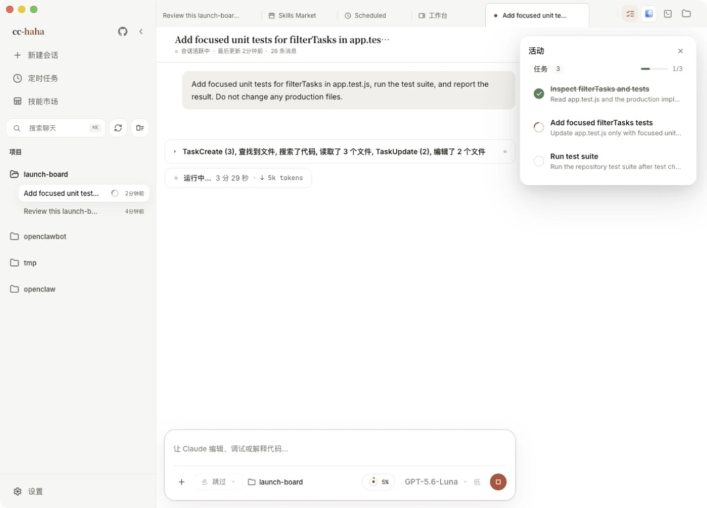
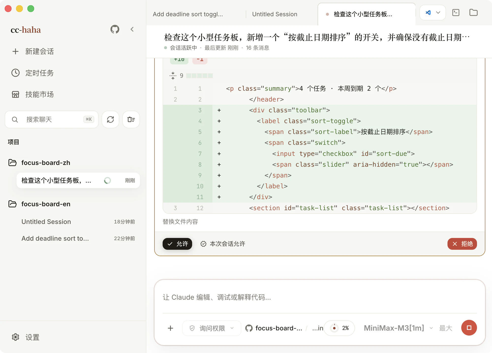

# 会话、权限与审阅

一条会话就是你和 Claude 的一次完整合作：你提要求，它读文件、跑命令、改代码，每一步都留在对话里可以回看。这一篇讲会话界面上的每个东西是干什么的。

## 开一条会话

点侧边栏的「新建会话」，或按 `⌘N`（Windows / Linux 是 `Ctrl+N`）。空会话首屏只要求你做一件事：选一个项目目录。选完就能提问了，模型和权限沿用你在设置里的默认值。

会话开出来是一个标签页，可以像浏览器一样开很多个并排跑。标签上有小圆点表示这条会话还在运行；关一个正在跑的标签会先问你是「保持运行」还是「停止并关闭」。

会话标题下面那行小字是元信息：项目路径、分支、模型。想换项目就新建一条会话，一条会话绑定一个目录。

## 读懂对话流

Claude 干活时不是一句话回你，中间会插进来几种卡片：

- **工具调用卡**：读文件、搜索、执行命令都会留一张卡。连续的同类操作会自动合并成一行，比如「读取了 6 个文件」「编辑了 3 个文件」，点开才展开细节。日常扫一眼就好，出问题时再展开看参数和输出。
- **思考块**：模型在动手前的推理过程，标题写「思考中」，结束后变成「已思考」。默认折叠。
- **文件编辑**：直接在对话里显示内联 diff，绿加红减，不用切到别处看。
- **Claude 需要你的输入**：它拿不准时会反问，给几个选项按钮，也可以自己输入回答。

对话很长时，`⌘F` 打开页内查找，可以在当前对话里跳上一个 / 下一个匹配。`⌘K` 是全局搜索，跨所有历史会话找内容。

## 权限弹窗：三个按钮怎么选

默认权限模式下，Claude 每次要改文件或跑高风险命令，都会停下来问你。弹窗里会先给出这次改动的预览，然后是三个按钮：

- **允许** — 只放行这一次。下次同样的操作还会再问。
- **本次会话允许** — 这条会话里同类操作以后都不问了。关掉会话就失效。
- **拒绝** — 不执行。Claude 会收到拒绝信号，换个做法继续。

拿不准就选「允许」，多问几次不亏。看不懂它要干什么时点「显示完整输入」，能看到原始参数。

### 五档权限模式

输入框工具栏上的权限按钮可以整体调松紧：

| 模式 | 它会做什么 |
|---|---|
| 询问权限 | CLI 请求时确认文件编辑和高风险命令 |
| 自动接受编辑 | Claude 无需询问即可写入磁盘 |
| 自动模式 | Claude 会审查工具调用，并执行其认为安全的操作 |
| 计划模式 | 仅架构和推理，不操作文件 |
| 跳过权限 | 对 Shell 和文件系统的完整工具访问 |

「自动模式」和「跳过权限」第一次开启需要确认一次。计划模式下 Claude 只出方案不动文件，方案写完会弹出「准备开始编码？」，你可以批准或者让它继续改方案。

会话正在跑的时候权限模式是锁住的，等这一轮结束才能改。

:::warning
「跳过权限」等于把 Shell 和整个文件系统交出去，只在你能随时恢复的隔离环境里用。
:::

## 改错了怎么撤

Claude 每完成一轮并修改文件，对话里会出现一张「{n} 个文件已更改」的卡片，列出这一轮碰过的文件。卡片上有两个动作：

- **撤销当前轮次** — 回滚最近一次回复，并把这一轮改过的文件恢复回去。
- **回滚到这一轮之前** — 对历史轮次用，把会话和文件一起退回那个检查点。

点了会先弹确认框，里面可以选**代码和对话一起回滚**，还是**只回滚对话**（保留磁盘上的文件不动）。

纯对话轮次或失败后没有文件变化时，不会显示空的文件卡片；回复下方会出现一个轻量的「回滚对话」入口。它会把会话退回这一轮之前并回填原提示词，磁盘上的文件保持不变。

检查点记录的是 Claude 通过编辑工具（Read/Edit/Write 那一类）改过的文件。**Shell 命令写出去的文件不在检查点里**：`npm install`、`rm`、重定向到文件的命令，撤销都还原不了。遇到这种轮次，卡片和确认框会点名是哪些工具没被记录，撤销照常可用，但只还原它列出的那些文件。需要兜底就用 git。

如果某一轮的文件检查点本身残缺（会话记录损坏、路径不安全等），代码就还原不了了，确认框里只剩「只回滚对话」——对话永远能退回去。

## 活动面板：它现在在忙什么

标签栏右侧第一个按钮打开活动面板，里面按区块列出这条会话的所有并行工作：

- **任务** — Claude 自己维护的待办清单，顶部显示「任务进度 3/7」。
- **SubAgent** — 它派出去的子 Agent，点进去能看子 Agent 完整的运行记录。
- **后台任务** — 挂在后台跑的命令和工作流，可以单独停掉某一个。
- **团队** — 用到 Agent Team 时，每个成员一行，可以点进去直接给某个成员发消息。

后台跑的子 Agent 的工具活动也会冒泡到这里，不用等它跑完才知道它在干什么。

## 输入框能干的事

- **`/` 斜杠命令** — 输入 `/` 弹出命令面板。`/status` 看会话状态和用量、`/context` 看上下文占用、`/compact` 压缩上下文、`/review` 审查改动、`/commit` 提交、`/memory` 打开项目记忆、`/doctor` 打开诊断检查。
- **`@` 引用文件或会话** — 输入 `@` 搜索文件和历史会话。文件以路径附到消息上；会话以可点击的引用附到消息上。
- **附件** — 点 `+` 选文件，或者直接把文件拖进输入框、把截图粘贴进来。图片、PDF、目录都收。
- **上下文用量环** — 那个小圆环显示当前上下文用掉多少，鼠标停上去能看到已用 / 剩余 / 窗口大小。快满了就 `/compact` 一下。
- **模型与推理强度** — 随时换模型；推理强度有低、中、高、极高、最大五档，不支持的模型会自动忽略。
- **运行位置** — 显示当前项目和分支。Git 项目可以在这里切分支，或者打开「独立工作树」，把这次试验隔离在主分支之外，详见[工作区](./workspace.md)。

发送方式默认是 Enter 发送、Shift+Enter 换行，可以在 设置 → 通用 里改成 `Ctrl/Cmd+Enter` 发送。`⌘.` 停止当前生成。

## 引用历史会话与分派工作

输入 `@`，搜索并选择之前的会话，再说明要参考什么，例如「参考 @登录方案 的结论，补充退出登录流程」。引用本身不复制整段历史，也不自动生成摘要。Claude 会按需读取所引用会话的一页内容，需要更多上下文时继续读取。点击消息中的会话引用可以打开原对话；引用不会向原对话发消息或让它继续运行。

要并行推进工作，可以直接说：「创建两个独立会话，一个检查接口，一个检查测试；互通发现，完成后向这里汇报。」Claude 可以使用以下工具：

| 工具 | 用途 |
|---|---|
| `ListSessions` | 查找已有会话 |
| `ReadSession` | 分页读取会话内容 |
| `CreateSession` | 新建独立会话并分派任务 |
| `SendSessionMessage` | 向另一个会话发送消息 |
| `WaitSessions` | 等待任务状态变化 |

新会话会出现在会话列表中，可以单独打开查看和继续交流。协作面板显示成员状态和消息，并提供打开成员会话的入口。消息「已排队」「已接收」「已读取」表示不同的送达阶段，不代表任务已经完成。

每组协作最多同时运行 3 个工作会话，其余排队；主控会话不占这 3 个名额。手动向排队中的工作会话发送消息也遵守这一上限；名额已满时会提示稍后重试，原任务继续排队。Git 项目中的新工作会话使用独立 worktree；非 Git 目录使用指定目录，因此并行编辑同一文件时仍需协调。任务 prompt 应包含必要背景，新工作会话不会自动复制主控的全部历史。

协作面板的「停止整组」会取消尚未读取的消息和排队任务，并停止整组，并阻止排队消息或完成回报自动唤醒它们。要继续某个成员，打开它并发送新的用户消息；这不会同时恢复整组。普通停止按钮只停止当前会话。子会话仍按自己的权限处理操作，另一会话的消息不能代替你的授权。

这项协作用于当前桌面端管理的本机会话，不会连接其他机器上的 Claude Code 或 Codex 会话。

## Fork 一条对话

历史消息上有「Fork 一个新对话」。从这条消息分叉出一条新会话，之前的上下文都在，之后的走向重来。想换个思路试试但又不想丢掉现在这条线时用它。
