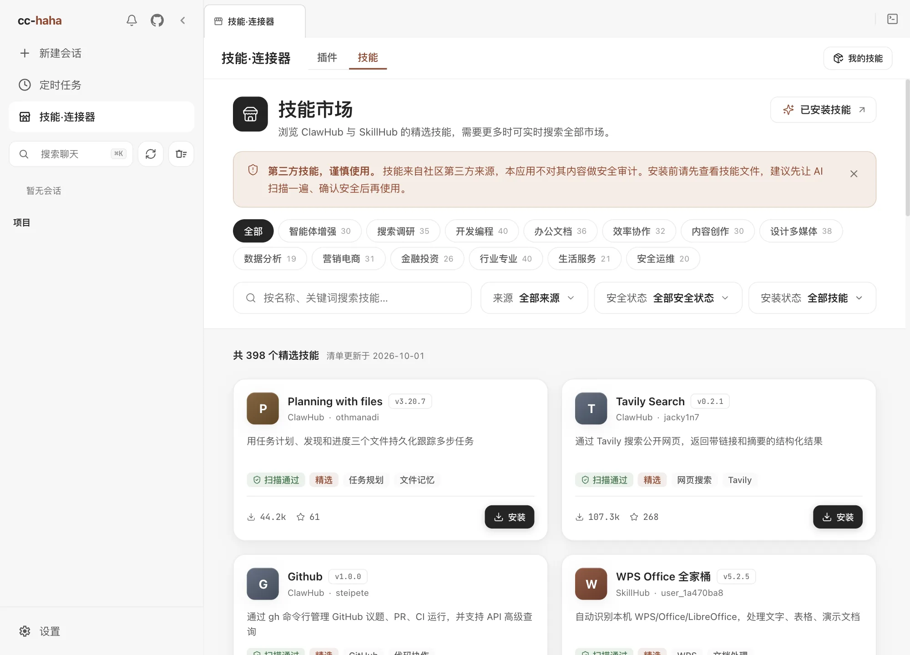

# 技能与技能市场

技能是别人写好的一套做法，装上以后 Claude 遇到对应场景就会照着做。比如一个「PDF 处理」技能会告诉它用哪个库、按什么顺序拆页、遇到加密文件怎么办——不用你每次都重新交代一遍。

**和 Agent 的区别**：Agent 是一个会干活的分身，有自己的上下文和工具范围；技能是一段知识和流程，被 Agent 加载来用。派 Agent 是「找个人去办」，装技能是「给他一本手册」。

## 技能市场

点侧边栏的「技能·连接器」，再切到顶部的「技能」。

ClawHub 和 SkillHub 上加起来有十几万个技能，大部分是重复的、搬运的或者早就没人维护了。所以市场首页不直接列出它们，而是一份**精选清单**：从两个来源里挑出来的近 400 个常用技能，分成智能体增强、搜索调研、开发编程、办公文档等 13 个分类，每个技能配一句中文简介和一两个标签，标了「精选」的是编辑推荐。清单随应用一起发布，打开就有，不用等网络。清单顶部会写更新日期，卡片上的下载量和星标是那天的数据。

- **分类** — 点上方的分类按钮只看这一类，按钮上的数字是这一类有多少个技能。
- **搜索** — 搜索框在精选清单里按名称、简介、标签和作者匹配。
- **筛选** — 来源（ClawHub / SkillHub）、安全状态、安装状态。

界面语言是英文、日文或韩文时，卡片显示作者的原始简介，不显示中文标签。

### 在全部市场中搜索

精选清单里找不到想要的，就点搜索框下方的「在全部市场中搜索」，直接查 ClawHub 和 SkillHub 的全部技能，这时输入关键词后按 Enter 才会搜索。这种结果**没有经过精选**，页面会单独标出来，装之前更要仔细看。清空搜索框就回到精选清单。

### 安全标记怎么读

每张卡片上有一个安全标记，它反映的是**来源方**的扫描结果，不是本应用的审计结论：

| 标记 | 含义 |
|---|---|
| 已认证 | 发布者已认证，且通过来源方安全扫描 |
| 扫描无风险 | 来源方安全扫描未发现风险 |
| 未审计 | 来源方没提供安全审计数据 |
| 存在风险 | 来源方扫描标记它有潜在风险 |

「未审计」不等于不安全，只是没人查过。「存在风险」的技能除非你自己看懂了它在干什么，否则别装。精选清单里只有少数几个广为推荐的技能带着「存在风险」标记，它们被标记的原因会在详情页写明。

## 安装之前

技能会带来新的工具、脚本和外部依赖，装上以后 Claude 就可能去执行它们。这些技能来自社区第三方作者，「精选」只是推荐，不是安全担保。

点开一个技能，详情页分几块：

- **概览** — 顶部的「安装前请了解：这个技能会做什么」会列出它要执行的命令或脚本、注册的 Hook、读取的密钥、访问的网络地址和写入的文件。这是按规则从 `SKILL.md` 和文件列表里识别出来的，只能参考，不能代替你自己读一遍。右侧「何时触发」是作者写的使用场景。
- **文件** — 逐个读 `SKILL.md` 和配套脚本。
- **安全报告** — 来源方每个扫描器的结论和完整报告链接。标记为「存在风险」时，这个标签旁边会有一个提示点。
- **更新日志** — 作者为最新版本写的说明（有的话）。

详情、文件和安装都会重新向来源方读取最新版本，不会用清单里的旧数据。

建议：

1. 至少读一遍 `SKILL.md` 和配套脚本。
2. 拿不准就让 Claude 先扫一遍——「帮我看看这个技能的文件里有没有可疑的东西」。
3. 确认你真的需要它。装得多不等于更强，每个技能都会占上下文。

点「安装」会弹确认框，里面写清了安装位置、这个技能会获得的能力，以及「安装完成后，技能将在新会话中生效」。对「未审计」或「存在风险」的技能，要先勾选「我已查看 SKILL.md 与安全报告」才能确认安装。**已经开着的会话不会立刻拿到新技能**，需要新建一条。安装只是下载文件，不会执行技能里的任何脚本。

卸载在同一个位置，会删掉本地对应目录下的文件。

## 已安装的技能

技能页右上角的「我的技能」，或者 设置 → 技能，都能看到本机所有可用技能，按来源分组：

- **用户** — 你装的，在 `~/.claude/skills/`。
- **项目** — 跟着仓库来的。
- **插件** — 某个插件打包带来的。
- **内置** — 应用自带的。

每条会显示入口文件、文件数和预估 token 占用。点进去可以在「文档模式」和「代码模式」之间切换，直接读技能的正文和源码文件。

### `.agents/skills` 跨客户端约定

除了 `~/.claude/skills/`，桌面端也会读 `~/.agents/skills/`。这是一个开放标准目录，Codex、Cursor、Gemini CLI 等客户端共享同一份技能——装一次，几个工具都能用。来自这个目录的技能在列表里会带一个 `.agents` 标记。

项目里的 `.agents/skills/` 同理，随仓库分发，不是你自己装的。

:::warning
跨客户端目录意味着别的工具装的技能这里也会生效。定期扫一眼 设置 → 技能 的列表，确认里面没有你不认识的东西。
:::

想了解技能的加载机制和文件格式，看[技能系统原理](../internals/skills.md)。
