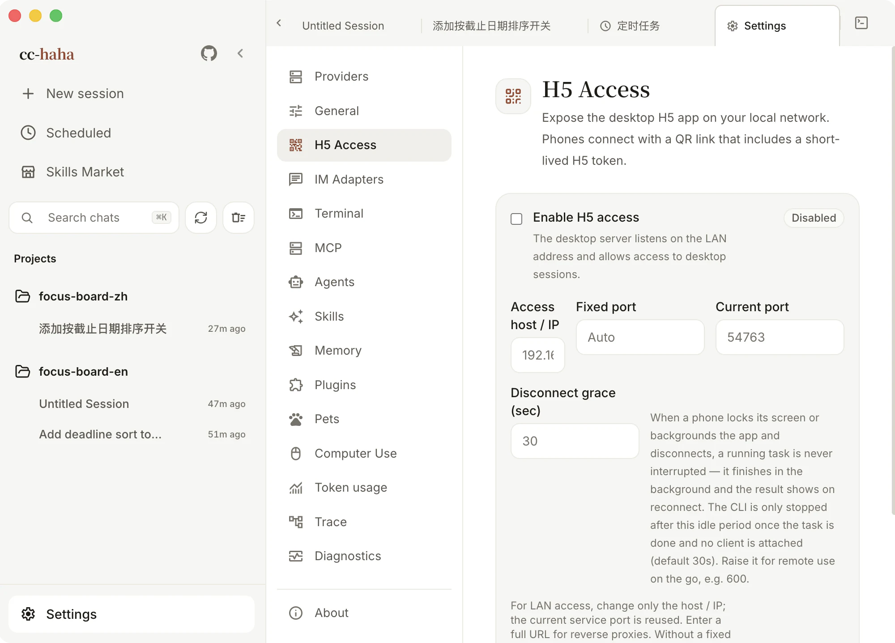
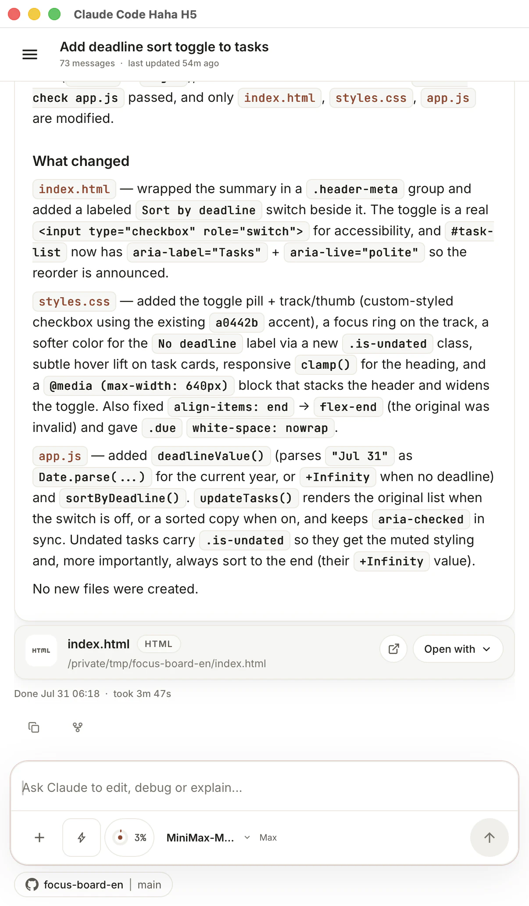
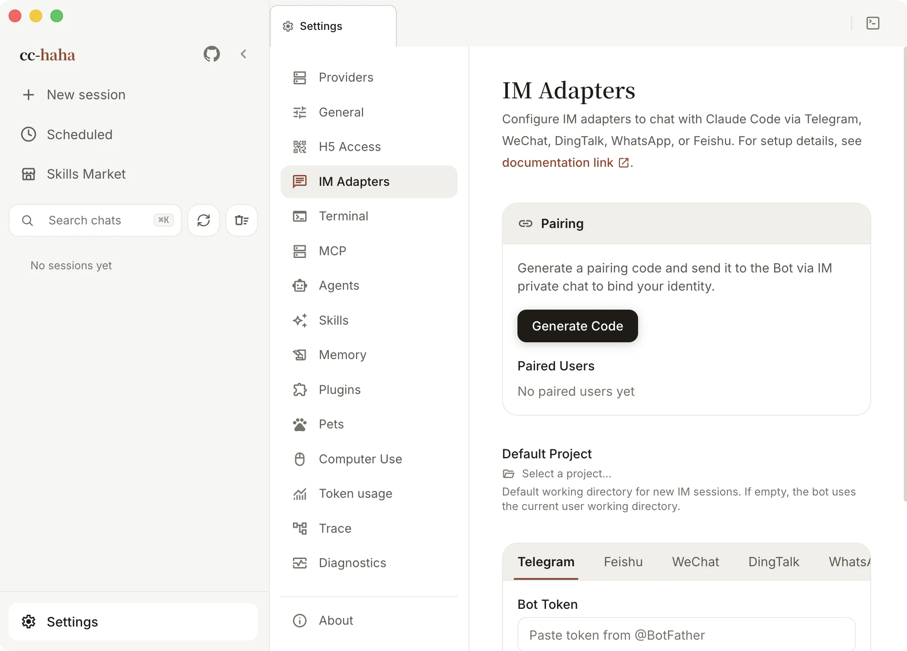

# Phone (H5) and IM

A task is running on your computer and you want to check on it, or add one more instruction, from your phone. Two routes:

- **H5 Access** — open the same interface in a mobile browser: sessions, messages, attachments, permission buttons, all of it.
- **IM Adapters** — talk to Claude directly inside WeChat, DingTalk, WhatsApp, Telegram, or Feishu.

Both require your computer to be on with the app running. Tasks execute on your computer; public tunnels and IM platforms carry content through their respective service providers.

## H5 Access

### Turning it on

1. Open **Settings → H5 Access**.
2. Turn on **Enable H5 access** and confirm after reading the warning.
3. Click **Generate token**. A QR code and an H5 link appear.
4. Scan it with your phone, or click **Copy launch URL** and send it to your own device.

The scanned link carries the server address and token. Scan with your phone camera and open it in your usual Safari, Chrome, or system browser. Successful verification stores the connection in that browser's localStorage and removes the token from the address bar. Scanning again or opening a bookmark reconnects automatically. Temporary network failures do not forget pairing; choose **Retry** to use the saved credential. A revoked or regenerated token requires a fresh QR code.

### The token is the credential

Anyone holding that link can reach what your desktop exposes. So:

- Never paste a link containing the token into a group chat, a public issue, a log screenshot, or any public page.
- Only enable it on networks you trust. For anything reachable from the internet, put HTTPS, a VPN, or access control in front of it — don't rely on one long-lived token.
- If you suspect a leak, click **Regenerate token**. The old QR code and old token stop working immediately. Turning H5 off and on again does *not* rotate the token.

Turn it off when you're not using it. That immediately rejects remote access while keeping the token, so the same one still works next time.

:::warning
H5 is off by default, and it isn't a public service. Confirm you're on a network you trust before enabling it.
:::

### Access host and fixed port

**Access host / IP** takes your computer's current LAN IP, e.g. `192.168.1.20`, on the current service port. After switching Wi-Fi or unplugging Ethernet the old IP may no longer be yours; the page notices and offers the working one.

If you run your own reverse proxy, put the full URL here instead — `https://cc.example.com` — and add that origin to **Allowed origins**.

A **fixed port** is worth setting when a phone bookmark has to stay valid, a firewall only opens specific ports, or Nginx or Caddy forwards to one fixed upstream. The port must be between 1024 and 65535, and the change takes effect after a restart — the page tells you which port is currently live in the meantime.

### Locking your phone won't kill the task

That's what **Disconnect grace** is for: when your phone locks, backgrounds the tab, or drops off the network briefly, **a running task is not stopped**. It finishes in the background and the result is waiting when you reconnect.

Only when a task is idle *and* nothing is connected does the CLI process stop, after the grace period. The default is 30 seconds and the valid range is 5 seconds to 24 hours. Raise it — say to 600 — if you're operating remotely for a while.

### What works on a phone

Session list and project switching, sending messages, stopping, streaming replies, image and file attachments, permission buttons, questions from Claude, `@` file references, copy and fork — the whole conversation flow.

The **Settings** entry at the bottom of the sidebar provides **Model providers** and **General**. Add, edit, delete, reorder, or switch providers on your phone. Existing API keys are never returned; leave a key blank while editing to keep it. Changing a model or image request URL requires entering the corresponding API key again, so saved credentials are not automatically sent to a new address. General settings include theme, interface language, response language, output style, reasoning effort, send behavior, thinking, and workflow keywords. Theme and interface language affect this browser; Agent preferences are shared with the computer.

Provider website login, configuration import, and desktop administration remain on the computer. The desktop workspace, embedded terminal, native "open with", Computer Use authorization, and the desktop pet are not part of H5. Remote terminal execution is deferred: the current terminal is owned by Electron and requires a separate device-authorized transport with reconnect and revocation support.

## Public access with ngrok

Open **Settings → H5 Access → Public access · ngrok** to connect your own ngrok account. You do not need to install ngrok or run commands. LAN settings remain independent.

1. Open the account link, sign up or sign in on ngrok's official website, and copy your **Authtoken**. This is the tunnel credential, not an API Key.
2. Paste it in the desktop app. Read the access and privacy notice, then choose **Agree and enable public access**.
3. Wait for the public address, generate a pairing QR code, scan it in your phone browser, and submit the pairing request.
4. Approve the phone on the desktop. Bookmark the public address for later visits.

Pairing codes expire after 5 minutes and can only be used once. Phone credentials last 30 days by default. Keep QR codes private. Revoke individual phones or turn off public access to disconnect remote clients immediately; running tasks continue.

The public entry also supports the provider and General settings above. Unrestricted local directory browsing and path-based file previews remain desktop-only; session-scoped file and review APIs remain available.

Once paired, public authorization persists in a secure browser cookie. Scanning again while it is valid opens the app without consuming another pairing code. Long-lived public credentials are not stored in localStorage. Camera scanning works in system browsers, but different browsers, private windows, and hostnames do not share authorization. If a scanner opens an embedded browser, switch to your preferred browser before pairing. Clearing browser data, expiration, or revocation requires pairing again.

**Privacy:** Standard ngrok HTTPS tunnels terminate TLS at ngrok, which then forwards traffic through an encrypted tunnel to your computer. ngrok can technically access the conversations, commands, and files being transferred. This is not end-to-end encryption that prevents the relay from reading content. The Authtoken is stored in a separate private file in the active application data directory, without system keychain encryption. Your local account or an administrator may read it. Deleting the saved credential does not close your ngrok account; revoke the credential at ngrok if it may have leaked.

Free accounts include an assigned development domain, with transfer and request quotas. Browsers may first show ngrok's warning page; continue to reach the app. The app never purchases an upgrade. See [ngrok's current free plan limits](https://ngrok.com/docs/pricing-limits/free-plan-limits).

Automatic restoration on desktop startup is off by default. Enable it to reconnect on later launches. Your computer must remain running, connected, and awake. Connectivity varies by network. For authentication or quota errors, follow the settings panel guidance before retrying.

## IM Adapters

**Settings → IM Adapters** supports five platforms, each connected differently:

| Platform | How to connect |
|---|---|
| WeChat | Generate a QR code in settings and scan it with WeChat to bind the account |
| DingTalk | Scan to create and authorize a bot in one step, or fill in Client ID / Secret manually |
| WhatsApp | Generate a QR code and scan it under **Linked devices** in WhatsApp |
| Telegram | Get a bot token from @BotFather and paste it in |
| Feishu | Enter an App ID and App Secret; if you don't have a bot, the page can create one from a template |

### Binding an account is not the same as allowing a person

This is the step people miss: **scanning only binds the account's messaging capability. Who is allowed to talk to the bot is a separate question.**

Under **Pairing**, click **Generate pairing code**, then send that code to the bot in a direct message from your own IM account. That completes the binding. Alternatively, list user IDs under **Allowed users**.

When both are empty, everyone is denied — that's deliberate, not a bug.

Paired users are listed below and can be unbound at any time; unbinding requires pairing again.

### Other settings

- **Default project** — the working directory for new IM sessions. Left empty, it uses your current user working directory. It's only a starting point — it doesn't restrict which projects the bot can reach.
- **Allowed project directories** — the boundary for the bot: `/projects` only lists projects inside these directories. Left empty, it defaults to your home directory (plus the default project, if it is outside home).
- **Streaming card mode** — updates the message content live, so it reads more like watching it type.
- **Permission requests** — DingTalk can use an interactive card template ID for button-based approval. Without it, every platform falls back to the `/allow`, `/always`, and `/deny` text commands.

For each platform's application flow, permission configuration, and troubleshooting, see [IM integrations](../im/index.md).
