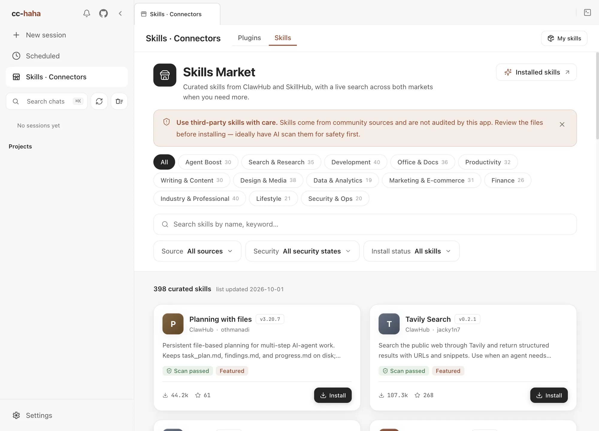

# Skills and the Skills Market

A skill is a procedure someone else already worked out. Install it and Claude follows it whenever the matching situation comes up. A "PDF handling" skill, for instance, tells it which library to use, what order to split pages in, and what to do with an encrypted file — so you don't have to explain it every time.

**How it differs from an agent**: an agent is a worker with its own context and tool scope; a skill is knowledge and procedure that an agent loads. Delegating to an agent is hiring someone; installing a skill is handing them a manual.

## The Skills Market

Click **Skills · Connectors** in the sidebar, then switch to **Skills** at the top.

ClawHub and SkillHub hold well over a hundred thousand skills between them, and most are duplicates, copies or abandoned experiments. So the market home doesn't list them directly. It opens on a **curated catalogue** instead: about 400 popular skills picked from both sources, sorted into 13 categories such as Agent Boost, Search & Research, Development and Office & Docs. Skills marked **Featured** are editor's picks. The catalogue ships with the app, so it appears instantly without waiting on the network. Its update date is shown at the top; download and star counts on the cards are from that date.

- **Categories** — click a category to see only that kind of skill. The number on each button is how many skills it holds.
- **Search** — the search box matches names, summaries, tags and authors within the catalogue.
- **Filters** — source (ClawHub / SkillHub), security status, and install status.

In an English, Japanese or Korean interface, cards show the author's original summary and hide the catalogue's Chinese tags.

### Search all markets

If the catalogue doesn't have what you need, click **Search all markets** under the search box to query every skill on ClawHub and SkillHub; in this mode a search runs when you press Enter. These results are **not curated**, and the page labels them that way — read them more carefully before installing. Clear the search box to return to the catalogue.

### Reading the security badges

Each card carries a security badge. It reports what the **source** scanned, not an audit by this app:

| Badge | Meaning |
|---|---|
| Verified | Publisher is verified and the skill passed the source's security scan |
| Scanned safe | The source's security scan found no risks |
| Not audited | The source provided no security audit data |
| Flagged | The source's scan flagged potential risk |

"Not audited" doesn't mean unsafe — it means nobody checked. "Flagged" means don't install it unless you've read the files and understand exactly what they do. The catalogue includes only a few flagged skills, all widely recommended, and the reason each one is flagged is written on its detail page.

## Before you install

A skill can bring new tools, scripts, and external dependencies, and once installed Claude may run them. These skills come from third-party community authors; **Featured** is a recommendation, not a security guarantee.

A skill's detail page has several parts:

- **Overview** — at the top, **Before installing: what this skill does** lists the commands or scripts it runs, hooks it registers, secrets it reads, network hosts it contacts and files it writes. It is detected by rules from `SKILL.md` and the file list, so treat it as a hint, not a substitute for reading the files. **When it triggers** on the right is the author's own list of situations.
- **Files** — read `SKILL.md` and any accompanying scripts.
- **Security report** — each of the source's scanners, with its verdict and a link to the full report. A flagged skill shows a dot next to this tab.
- **Changelog** — the author's notes for the latest version, when there are any.

Detail, files and installation always re-read the latest version from the source rather than the catalogue's snapshot.

Recommended:

1. Read `SKILL.md` and any accompanying scripts at least once.
2. If you're unsure, have Claude look first — "check this skill's files for anything suspicious".
3. Confirm you actually need it. More skills isn't more capability; every skill costs context.

**Install** opens a confirmation with the install location, what the skill will be able to do, and a reminder that it takes effect in new sessions. For a **Not audited** or **Flagged** skill you must first tick "I have read SKILL.md and the security report" before you can confirm. **Sessions already open won't pick it up** — start a new one. Installing only downloads files; it never runs the skill's scripts.

Uninstall lives in the same place and deletes the local files under that skill's directory.

## Installed skills

**My skills** at the top right of the Skills page, or **Settings → Skills**, lists everything available on this machine, grouped by source:

- **User** — installed by you, in `~/.claude/skills/`.
- **Project** — shipped with the repo.
- **Plugin** — bundled by a plugin.
- **Built-in** — shipped with the app.

Each entry shows its entry file, file count, and estimated token cost. Open one to switch between **doc mode** and **code mode** and read the skill's prose and source files directly.

### The `.agents/skills` convention

Besides `~/.claude/skills/`, the desktop app also reads `~/.agents/skills/`. That's an open standard directory shared with Codex, Cursor, Gemini CLI, and other clients — install once, use it everywhere. Skills from that directory are tagged `.agents` in the list.

A project's own `.agents/skills/` works the same way: it ships with the repo rather than being something you installed.

:::warning
A shared directory means skills another client installed also apply here. Scan **Settings → Skills** occasionally and make sure nothing on the list is a stranger.
:::

For how skills are loaded and what the file format is, see [Skills internals](../internals/skills.md).
